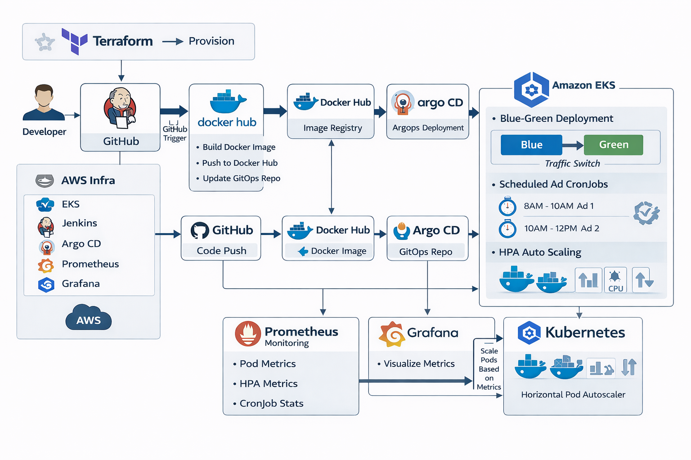
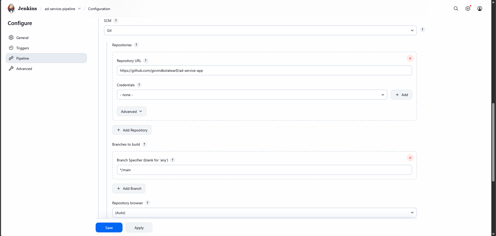
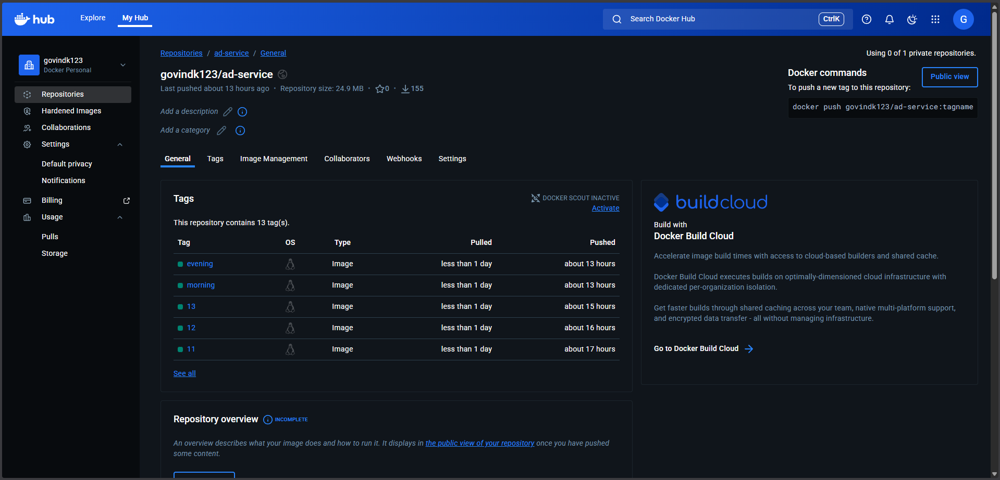
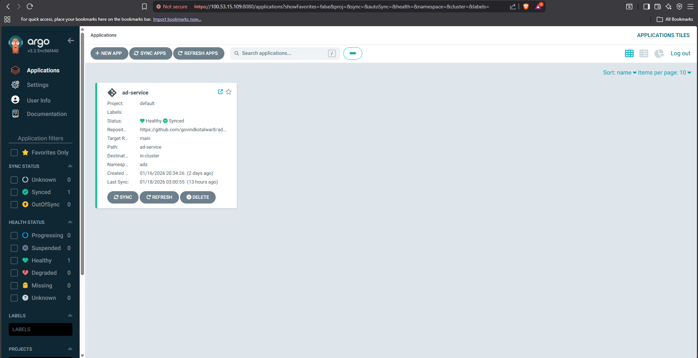
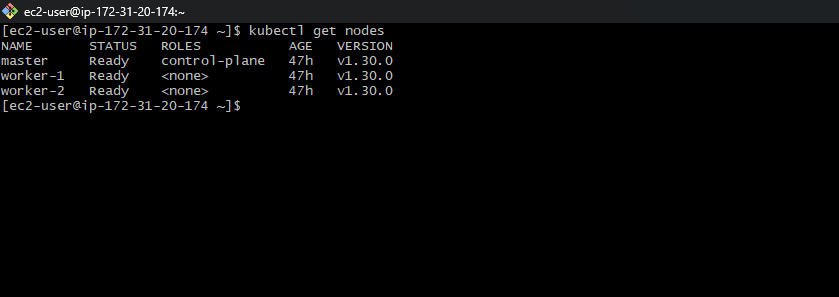
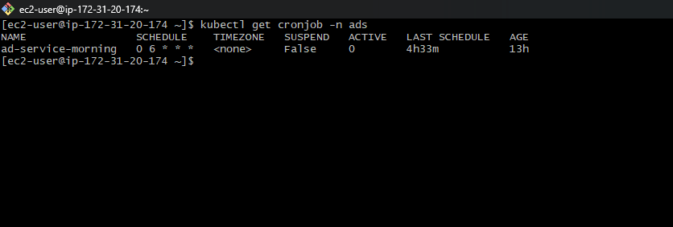
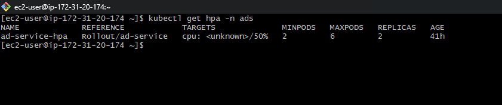
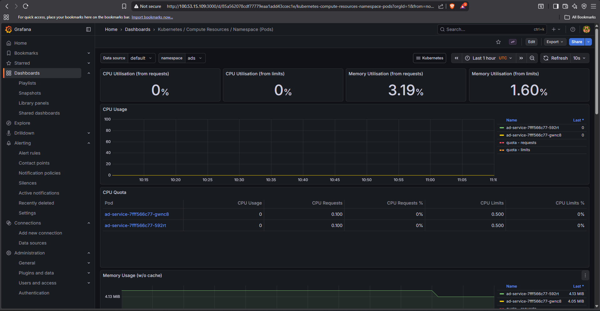
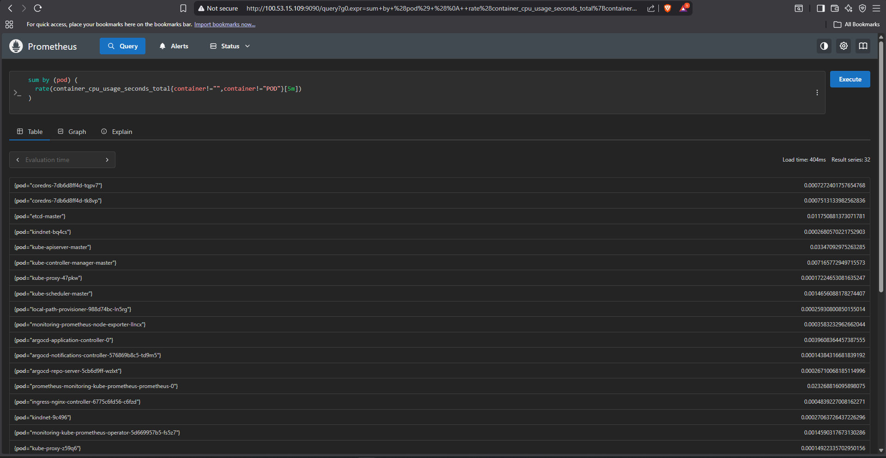

# Ad Scheduling Platform

This project demonstrates a **production-style, cloud-native CI/CD and GitOps workflow** for an advertisement delivery and scheduling platform running on **Kubernetes (Kind)**

It is intentionally designed to mirror how **real DevOps** build, deploy, scale, monitor, and operate microservices in modern cloud environments.

---

## High-Level Architecture

**End-to-end pipeline:**

GitHub → Jenkins → Docker Hub → Argo CD → K8S → HPA & CronJobs → Prometheus & Grafana

All infrastructure is provisioned using **Terraform (Infrastructure as Code)**.

---

## Architecture Diagram

Add your exported diagram here:

```
/docs/architecture.png
```



**Diagram Highlights:**

* CI pipeline triggered by GitHub webhooks
* Immutable container images stored in ECR
* GitOps-based deployments using Argo CD
* Auto-scaling and scheduled workloads inside EKS
* Centralized monitoring with Prometheus and Grafana

---

## Core Components

### 1. Source Control – GitHub

* Hosts application source code and Kubernetes manifests
* GitOps repository acts as the **single source of truth**
* Every commit triggers CI

### 2. Continuous Integration – Jenkins

* Executes build and test stages
* Builds Docker images
* Tags images using commit SHA or version
* Pushes images to Amazon ECR

**Screenshot to add:**

```
/docs/jenkins-pipeline.png
```



---

### 3. Container Registry – Amazon ECR

* Secure, private Docker image registry
* Versioned images enable rollbacks
* Integrated with IAM authentication

**Screenshot to add:**

```
/docs/ecr-repo.png
```



---

### 4. Continuous Delivery – Argo CD (GitOps)

* Continuously watches GitOps manifests
* Automatically syncs desired state to EKS
* Provides visual diff and rollback support

**Screenshot to add:**

```
/docs/argocd-app.png
```



---

### 5. Orchestration – Amazon EKS

* Runs containerized ad services
* High availability using multiple nodes
* Self-healing through Kubernetes controllers

**Screenshot to add:**

```
/docs/eks-nodes.png
```



---

### 6. Scheduling – Kubernetes CronJobs

* Handles time-based ad campaigns
* Executes batch jobs (campaign activation, expiry)
* Fault-tolerant and observable

**Screenshot to add:**

```
/docs/cronjobs.png
```



---

### 7. Auto Scaling – Horizontal Pod Autoscaler (HPA)

* Scales pods based on CPU utilization
* Ensures performance during traffic spikes
* Reduces cost during low traffic

📸 **Screenshot to add:**

```
/docs/hpa.png
```



---

### 8. Monitoring & Observability – Prometheus & Grafana

#### Grafana Dashboard

```
/docs/grafana.png
```



**Metrics Tracked:**

* Pod CPU & memory usage
* Request throughput
* Pod restarts
* Node health

#### Prometheus Targets

```
/docs/prometheus.png
```



---

### 9. Infrastructure as Code – Terraform

* Provisions VPC, EKS, ECR, IAM roles
* Enables repeatable and auditable infrastructure
* Supports environment recreation


## Repository Structure

```
.
├── terraform/           # AWS infrastructure (VPC, EKS, ECR)
├── jenkins/             # Jenkinsfile and CI scripts
├── k8s/                 # Kubernetes manifests
│   ├── deployment.yaml
│   ├── service.yaml
│   ├── hpa.yaml
│   └── cronjob.yaml
├── argocd/              # Argo CD application manifests
├── docs/                # Architecture diagrams & screenshots
└── README.md
```

---

## CI/CD Flow

1. Developer pushes code to GitHub
2. GitHub webhook triggers Jenkins
3. Jenkins builds and tests application
4. Docker image is pushed to Amazon ECR
5. GitOps repo is updated with new image tag
6. Argo CD syncs manifests to EKS
7. Kubernetes updates workloads
8. HPA scales pods based on load
9. CronJobs execute scheduled ad tasks

---

## Security Best Practices Implemented

* IAM Roles for Service Accounts (IRSA)
* No hardcoded secrets in code
* Kubernetes Secrets for sensitive values
* Least-privilege IAM policies
* Private ECR repositories

---

## Rollback Strategy

* Image versioning in ECR
* Git revert in GitOps repository
* Argo CD automatic rollback
* Kubernetes Deployment revision history

---

## Use Case

This platform simulates a **real-world advertisement delivery system** where:

* Ads are deployed continuously via CI/CD
* Traffic spikes are handled automatically
* Scheduled ad campaigns run reliably
* System health is visible in real time

---

## Key DevOps Concepts Demonstrated

* Infrastructure as Code (Terraform)
* GitOps deployment model
* CI/CD automation
* Kubernetes scheduling & scaling
* Cloud-native observability
* Production-style AWS architecture

---

## Author

**Govind**
DevOps Engineer
(Cloud-Native Project Demonstration)

---

⭐ *This project is ideal for demonstrating real-world DevOps skills in interviews and portfolios.*
